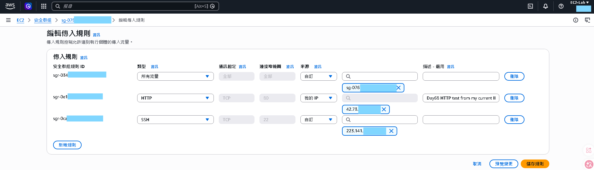
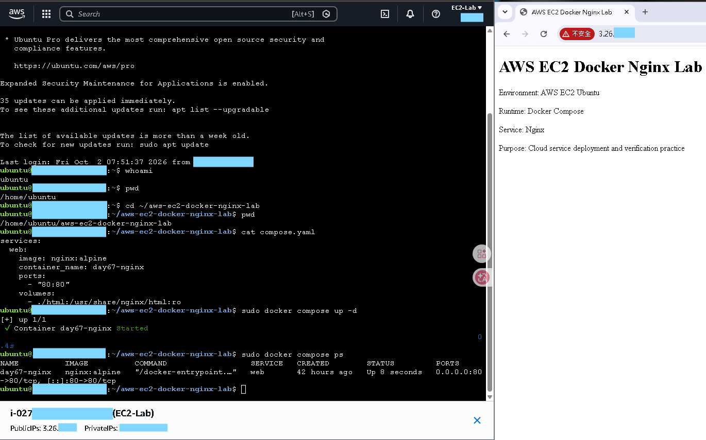
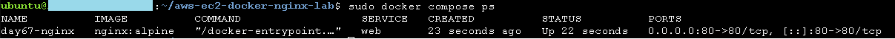
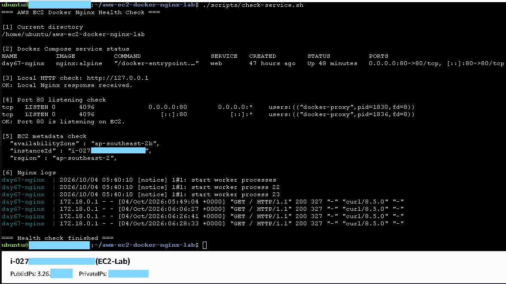
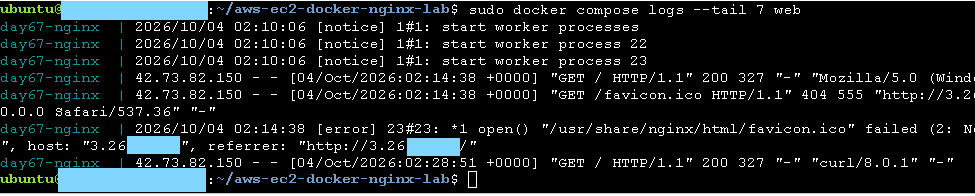

# AWS EC2 Docker Nginx Lab

## Project Overview

This project demonstrates how to deploy a simple Nginx web service on an AWS EC2 Ubuntu instance using Docker Compose.

The goal of this lab is to practice basic cloud service deployment, Linux operation, Docker Compose usage, Security Group configuration, service verification, and log inspection.

## Architecture

```text
[Windows Browser / PowerShell]
        ↓
[Internet]
        ↓
[EC2 Public IPv4]
        ↓
[Security Group: HTTP 80 from My IP]
        ↓
[EC2 Ubuntu Host Port 80]
        ↓
[Docker Compose Port Mapping 80:80]
        ↓
[Nginx Container]
        ↓
[HTML Response]
```

## Tech Stack

- AWS EC2
- Ubuntu Server
- Docker
- Docker Compose
- Nginx
- Linux shell
- Security Group
- curl

## Project Structure

```text
aws-ec2-docker-nginx-lab/
├── README.md
├── compose.yaml
├── html/
│   └── index.html
├── scripts/
│   └── check-service.sh
├── screenshots/
└── .gitignore
```

## Deployment Steps

### 1. Create the project folder

```bash
mkdir -p ~/aws-ec2-docker-nginx-lab/html
cd ~/aws-ec2-docker-nginx-lab
```

### 2. Create the Nginx test page

```bash
nano html/index.html
```

### 3. Create Docker Compose configuration

```bash
nano compose.yaml
```

### 4. Start the service

```bash
sudo docker compose up -d
```

### 5. Check service status

```bash
sudo docker compose ps
```

### 6. Verify local response inside EC2

```bash
curl http://127.0.0.1
```

### 7. Open HTTP inbound rule in Security Group

Security Group inbound rule:

```text
Type: HTTP
Protocol: TCP
Port: 80
Source: My IP
```

### 8. Verify public access from Windows

```powershell
curl.exe http://EC2_PUBLIC_IP
```

Or open the following URL in a browser:

```text
http://EC2_PUBLIC_IP
```

## Health Check

A basic health check script is included:

```bash
./scripts/check-service.sh
```

The script checks:

```text
Docker Compose service status
Local HTTP response
Port 80 listening status
Nginx logs
EC2 metadata
```

## Verification Evidence

The project can be verified with:

```text
sudo docker compose ps
curl http://127.0.0.1
curl.exe http://EC2_PUBLIC_IP
sudo docker compose logs --tail 30 web
./scripts/check-service.sh
```


## What I Learned

Through this lab, I practiced:

```text
Creating and using an AWS EC2 Ubuntu environment
Deploying Nginx with Docker Compose
Mapping EC2 host port 80 to container port 80
Configuring Security Group HTTP inbound access
Verifying service response with curl and browser
Checking Docker Compose service status
Inspecting Nginx logs
Writing a basic service health check script
Understanding basic cloud cleanup and exposure review
```
## Screenshots

### Security Group HTTP rule



### Public browser access



### Docker Compose service status



### Health check script result



### Nginx logs


